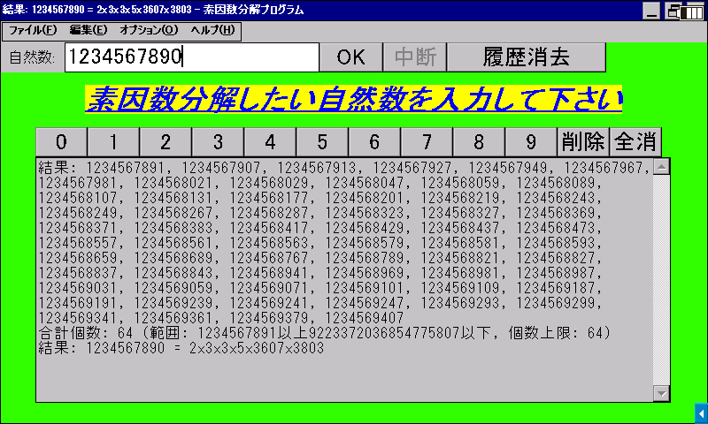

# 素因数分解

[English](README.md) / **日本語**

[試し割り法](https://ja.wikipedia.org/wiki/%E8%A9%A6%E3%81%97%E5%89%B2%E3%82%8A%E6%B3%95)を用いて、入力された自然数の素因数分解や指定範囲の素数の列挙を行います。

## 動作環境

- **Windows 2000 以降**
  - Windows 2000 SP4, XP SP3, 11 で動作確認済み
- **Windows CE .NET 4.0 以降**
  - [SHARP Brain PW-SH1](https://jp.sharp/support/dictionary/product/pw-sh1.html) (CE 6.0 with Armv5TEJ CPU), [Sigmarion III](https://www.hpcfactor.com/hardware/devices/141/NTT_Do_Co_Mo/Sigmarion_III) (CE 4.1 with Armv4 CPU), [MobilePro 900](https://www.hpcfactor.com/hardware/devices/134/NEC/MobilePro_900) (CE 4.2 with Armv5TE CPU), [HP t5540](https://www.hpcfactor.com/hardware/devices/254/Hewlett_Packard/t5540) (CE 6.0 R3 with x86 CPU) で動作確認済み
- **[Wine](https://www.winehq.org/)**
  - macOS や Linux 等で動作させる場合に使用します
  - M2 MacBook Air にて AMD64 版が Rosetta 2 で動作することを確認済みです

SHARP Brain について、対応機種等の情報は [Brain Wiki](https://brain.fandom.com/ja) を参考にしてください。日本語で使用する場合は電子辞書の日本語化が必要です。

## 使い方

> [!NOTE]
> 一部のセキュリティソフトは、署名のない個人開発のソフトウェアをマルウェアと誤判定します。この現象に遭遇した場合は、チェスト等の隔離空間から復元／許可して実行してください。ソフトウェアの安全性に関して心配な場合は、ソースコードを確認して自分でコンパイルすることもできます。

[Releases](../../releases) からご使用のコンピュータに合った実行ファイルを取得し、実行します。インストール作業は不要です。アンインストールも、レジストリ等は使用しないので実行ファイルを削除するだけで可能です。

起動すると素因数分解モードになります。素因数分解したい数を上部の入力ボックスに入力し、OK か Enter キーを押すと計算を開始します。

メニューバーのオプションから素数列挙・数え上げの機能に切り替えられます。探す範囲と上限の個数を指定し、OK または Enter キーを押すと計算を開始します。空欄は無制限として扱われます。出力ボックスには 65,535 文字の字数上限があるので、テキストファイルへの出力も選択できます。

「ファイル」から出力ボックスの内容をテキストファイルに書き出したり、クリップボードにコピーしたりできます。表示言語はオプションの Language で切り替えます。SHARP Brain において、数値は画面上のボタンや本体キーボード（アルファベット入力状態のままで OK）で入力できます。

## 利用許諾条件（ライセンス）

[MIT License](LICENSE) で配布します。当ソフトウェアを利用する際には必ず確認してください。
