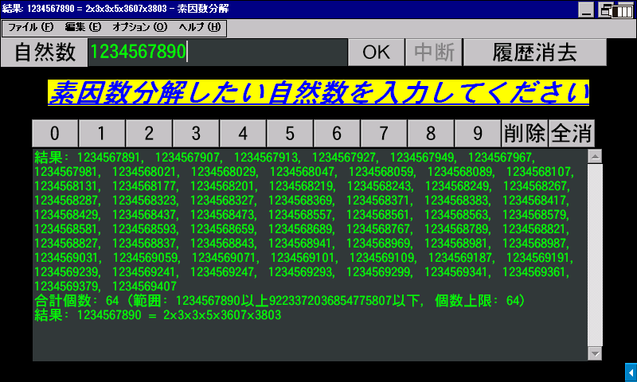

# 素因数分解

[English](README.md) / **日本語**



[試し割り法](https://ja.wikipedia.org/wiki/%E8%A9%A6%E3%81%97%E5%89%B2%E3%82%8A%E6%B3%95)を用いて、入力された自然数の素因数分解や指定範囲の素数の列挙を行います。

## 動作環境

- **Windows XP 以降**
  - Windows XP, 7, 10, 11 で動作確認済み
  - Windows 2000 でも起動はしますが、64-bit 整数を扱えないため計算処理できません
- **Windows CE .NET 4.0 以降**
  - [SHARP Brain PW-SH1](https://jp.sharp/support/dictionary/product/pw-sh1.html) (CE 6.0 with Armv5TEJ CPU), [Sigmarion III](https://www.hpcfactor.com/hardware/devices/141/NTT_Do_Co_Mo/Sigmarion_III) (CE 4.1 with Armv4 CPU), [MobilePro 900](https://www.hpcfactor.com/hardware/devices/134/NEC/MobilePro_900) (CE 4.2 with Armv5TE CPU), [HP t5540](https://www.hpcfactor.com/hardware/devices/254/Hewlett_Packard/t5540) (CE 6.0 R3 with x86 CPU) で動作確認済み
- **[Wine](https://www.winehq.org/)**
  - macOS や Linux 等で動作させる場合に使用します
  - macOS では AMD64 版を Rosetta 2 で実行します

SHARP Brain への導入方法は [Brain Wiki](https://brain.fandom.com/ja/wiki/%E3%82%A2%E3%83%97%E3%83%AA%E3%81%AE%E8%B5%B7%E5%8B%95%E6%96%B9%E6%B3%95) を参考にしてください。日本語で使用する場合は電子辞書の日本語化が必要です。

## 使い方

> [!NOTE]
> 一部のセキュリティソフトは、署名のない個人開発のソフトウェアをマルウェアと誤判定します。この現象に遭遇した場合は、チェスト等の隔離空間から復元／許可して実行してください。ソフトウェアの安全性に関して心配な場合は、ソースコードを確認して自分でコンパイルすることもできます。

[Releases](../../releases) からご使用のコンピュータに合った実行ファイルを取得し、実行します。インストール作業は不要です。アンインストールも、レジストリ等は使用しないので実行ファイルを削除するだけで可能です。

起動すると素因数分解モードになります。素因数分解したい数を画面上部の入力ボックスに入力し、OK か Enter キーを押すと計算を開始します。

メニューバーのオプションから素数列挙・数え上げの機能に切り替えられます。探す範囲と上限の個数を指定し、OK または Enter キーを押すと計算を開始します。空欄は無制限として扱われます。出力ボックスには 65,535 文字の字数上限があるのでテキストファイル出力も可能です（画面より高速）。

「ファイル」から出力ボックスの内容をテキストファイルに書き出したり、クリップボードにコピーしたりできます。表示言語はオプションの Language で切り替えます。数字キーがないデバイスでも、画面上のボタンやキーボードの QWERTY 列（アルファベット入力状態のままで OK）で数値入力できます。

## ビルド

これらの環境をサポートしています。

- [Visual Studio](vs2026)
- [BCC Developer](bccdev)
- llvm-migw or mingw-w64 via [`src/win.sh`](src/win.sh) and [`src/win.bat`](src/win.bat)
  - [llvm-mingw](https://github.com/mstorsjo/llvm-mingw/) または [MinGW-w64](https://www.mingw-w64.org/) に PATH が通っている必要があります
  - 環境変数 `PREFIX32`/`PREFIX64`/`PREFIXA32`/`PREFIXA64` を設定し、別のツールチェーンを使うことも可能です
- [eMbedded Visual C++](evc4)
- CeGCC via [`src/brain.sh`](src/brain.sh) and [`src/brain.bat`](src/brain.bat)
  - [CeGCC (GCC 9)](https://github.com/brain-hackers/cegcc-build/releases) に PATH が通っている必要があります
  - 環境変数 `PREFIX` を設定し、別のツールチェーンを使うことも可能です
- [Pocket GCC 1.50](https://ux.getuploader.com/brainup2ch/download/37) via [`src/pgcc.bat`](src/pgcc.bat)
  - Windows CE 端末に [Brain Wiki](https://brain.fandom.com/ja/wiki/%E3%83%97%E3%83%AD%E3%82%B0%E3%83%A9%E3%83%9F%E3%83%B3%E3%82%B0) 等を参考に PocketGCC 1.50 と DOS窓Open を導入し、[`src/pgcc.bat`](src/pgcc.bat) でビルドしてください
  - `src` フォルダだけ転送し、適宜バッチファイル冒頭のパスを書き換えれば OK です
  - eMbedded Visual C++ 4.0 の Standard SDK 等からコピーした `commctrl.lib` をリンカに読み込ませる必要があります（大量の警告が出ますが問題ありません）

## ソース階層

```
src/
├─ main.cpp / main.hpp : Entry point and global definitions
│  ├─ msg.cpp / msg.hpp : Message handlers
│  ├─ runner.cpp / runner.hpp : Prime calculation managers
│  ├─ ui.cpp / ui.hpp : UI functions
│  └─ wproc.cpp / wproc.hpp : Window procedures
│
├─ util.cpp / util.hpp : Utility functions
│
└─ resource*.rc / resource.h : Resource
    ├─ app*.ico : Application icon
    └─ app.manifest : Application manifest
```

## 利用許諾条件（ライセンス）

[MIT License](LICENSE) で配布します。当ソフトウェアを利用する際には必ず確認してください。
