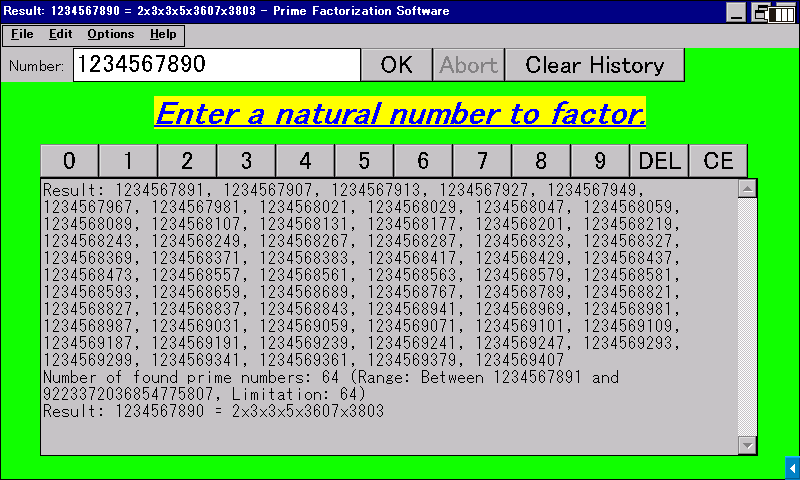

# Prime Calculator

**English** / [日本語](README-JA.md)

This software factors a natural number into prime numbers and looks up prime numbers within a specified range, with the [trial division](https://en.wikipedia.org/wiki/Trial_division) algorithm.

## Supported Platforms

- **Windows 2000 or later**
  - Tested on Windows 2000 SP4, XP SP3, and 11.
- **Windows CE .NET 4.0 or later**
  - Tested on [SHARP Brain PW-SH1](https://jp.sharp/support/dictionary/product/pw-sh1.html) (CE 6.0 with Armv5TEJ CPU), [Sigmarion III](https://www.hpcfactor.com/hardware/devices/141/NTT_Do_Co_Mo/Sigmarion_III) (CE 4.1 with Armv4 CPU), [MobilePro 900](https://www.hpcfactor.com/hardware/devices/134/NEC/MobilePro_900) (CE 4.2 with Armv5TE CPU), and [HP t5540](https://www.hpcfactor.com/hardware/devices/254/Hewlett_Packard/t5540) (CE 6.0 R3 with x86 CPU).
- **[Wine](https://www.winehq.org/)**
  - Enables macOS and Linux to run this Prime Calculator.
  - Tested the AMD64 version on M2 MacBook Air (Rosetta 2).

Read [Brain Wiki](https://brain.fandom.com/ja) for supported Sharp Brain electronic dictionary devices.

## How To Run

> [!NOTE]
> Some pieces of anti-malware software falsely labels software from individual developers as malware. If you faced this behavior on this software, restore it from the chest or allow it. You can check out the source code and build it yourself if you are not sure whether this software is safe.

Download an appropriate one from [Releases](../../releases) and run it on your device. No installation needed. You can also uninstall this software just by removing the executable file itself, as it doesn't touch the system registry or such.

You will first see the "Prime Factorization" mode. Enter a natural number in the input box and press the OK button or the Enter key, to get the result.

You can switch to the "Enumerate Prime Numbers" mode in the Options menu. Specify a range to enumerate prime numbers and a max count within, and press the OK button or the Enter key to start. You can set to use a text file as the output destination, as the output box can only hold 65,535 or less characters.

You can use the File menu to export the contents in the output box to a text file or copy it to the clipboard. Also, you can use the top row (QWERTY...) keys to input numbers if your device does not have number keys.

## License

This software is licensed under the [MIT License](LICENSE). You must agree with the licensing terms to use this software.
